# What's inside the package?

- ESP32 (arduino controller with WiFi and BLE capabilities)
- Arduino nano (microcontroller)
- Yellow, Red & Green LED's
- Pushbutton switches
- jumper wires (M/M & F/F)
- LDR (light sensor)
- 220 Ohm Resitor (8x)
- 1k Ohm Resistor (2x)
- 10k Ohm Resistor (2x)
- breadboard (2x)
- Oled screen
- Battery holder
- 433Mhz wireless module (sender and receiver)
- Accelerometer

# Basic Electronics

Electricity works much like water flowing through a pipe. Voltage is like water pressure, it pushes the electrical current through a circuit. Current is the flow of electricity, like the amount of water moving through the pipe. Resistance is like a narrowing in the pipe, it restricts flow. According to **Ohm’s Law**, **voltage (V)** equals **current (I)** times **resistance (R)**: **V = I × R**.

So, higher resistance means less current flows, unless you increase the voltage. An ESP32 typically runs on 3.3 volts, so understanding the relation between voltage, current, and resistance helps you power components correctly and control how they behave.

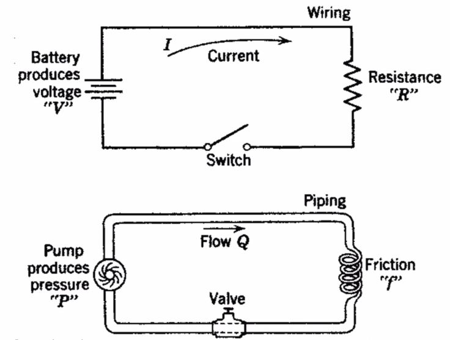

## Ohm's law
Ohm’s Law can be rearranged to find any missing value if you know two of the three:

```
V = I × R (voltage)  
I = V ÷ R (current)  
R = V ÷ I (resistance)
```

The standard units for the three elements of Ohm’s Law are:

- Voltage: volt (V)
- Current: ampere (A)
- Resistance: ohm (&#8486;)

## Resistor
Resistors can be used to limit the current.

To know the resistance value for a certain resistor in your kit you'll need to look at the color bands.
You can use a [online calculator](https://www.calculator.net/resistor-calculator.html).

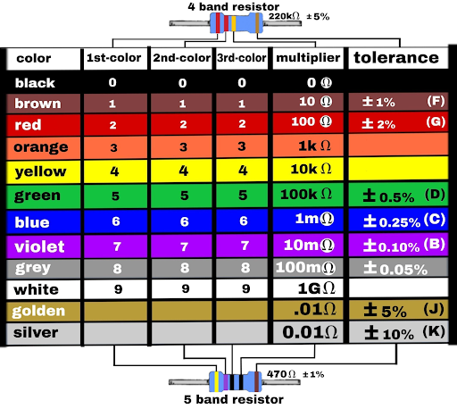

You have 220&#8486;, 1k&#8486; and 10k&#8486; resistors. Find which is which and label them?


## LEDs
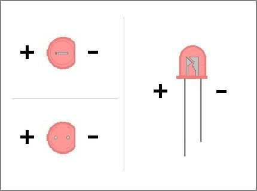

LEDs are Light Emitting Diodes. They are semiconductors that only conduct in one direction (+ to -). When their polarity is reversed they won't light up.


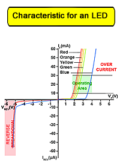

Overcurrent is an important factor to consider when working with LEDs. It happens when too much current flows through the LED, which can break it or burn out faster. To prevent this a resistor is used to control how much current runs through the LED.

You can use online led-resistor calculators like this: [https://ohmslawcalculator.com/led-resistor-calculator](https://ohmslawcalculator.com/led-resistor-calculator)

A red LED typically has a forward voltage (or voltage drop) of 1.8 - 2 Volt. The current it uses depends on the resistor. Normal use is around 20 mA. Lower current makes it shiine less bright, but keeps the life span longer.

## Pushbuttons

Pushbutton switches can be used to close a circuit when pressed or open it when released.
To use them it can be helpfull to know how they are wired internally.

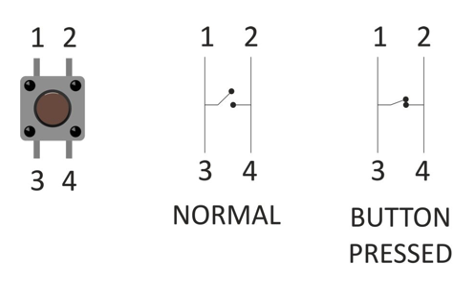

# esp32

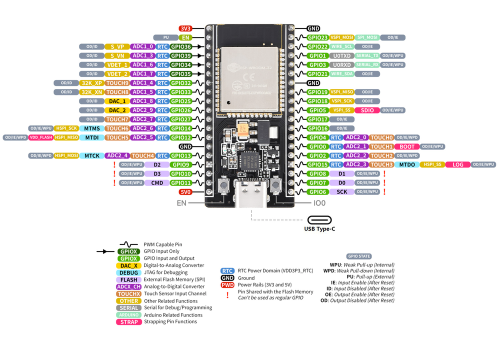


# platform.io

Download as a plugin for Visual Studio Code. More info: [https://platformio.org/platformio-ide](https://platformio.org/platformio-ide)
Guide also here [https://randomnerdtutorials.com/vs-code-platformio-ide-esp32-esp8266-arduino/](https://randomnerdtutorials.com/vs-code-platformio-ide-esp32-esp8266-arduino/)

## Create new project


## Configure for esp32

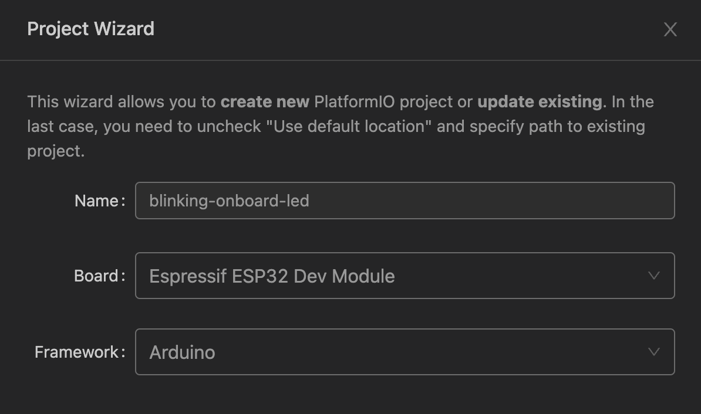

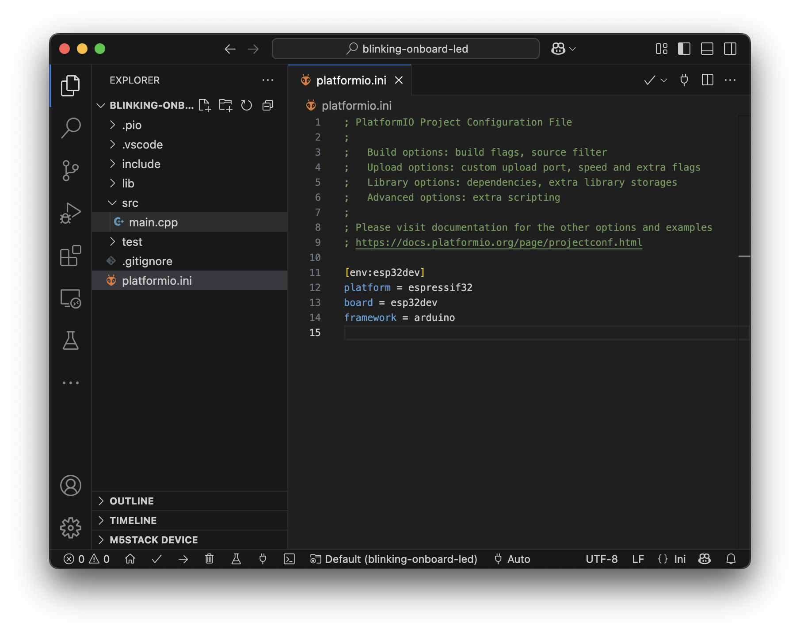

Two important files:
- ```src/main.cpp```: primary code file
- ```platformio.ini```: config file for your project

If you don't use them, you can delete the ``include``, ``lib`` and ``test`` folder.

# blinking onboard led

Use the onboard blue led. Make it blink.

Example project: [blinking-onboard-led project](01-blinking-onboard-led)


## connect your esp32 and upload

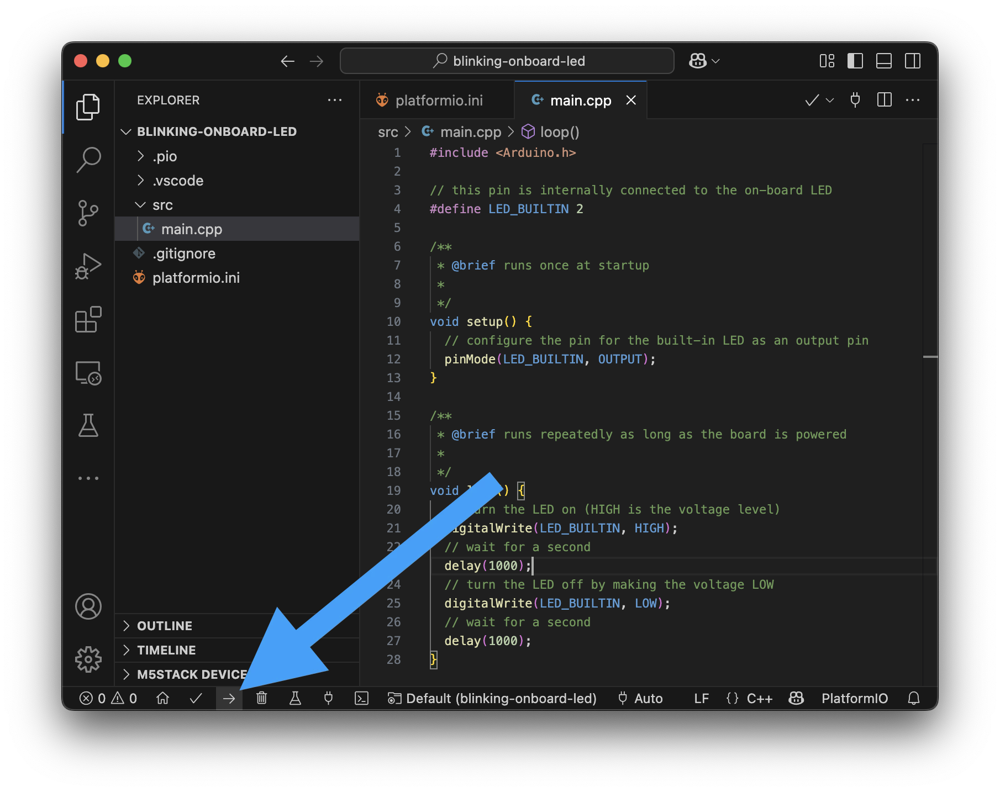

## check the result

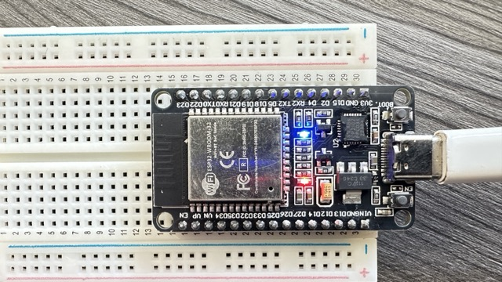

# led wiring

## breadboard: internal wiring

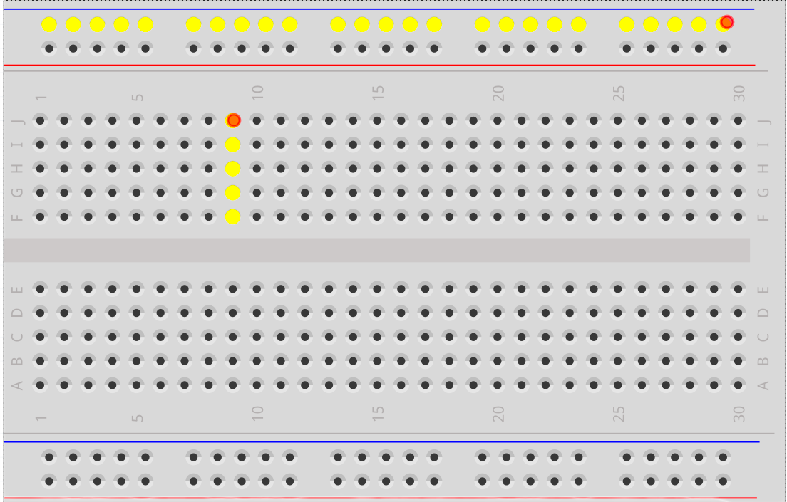

## powering led with Vin

Build this circuit, give the esp32 power via the usb cable and watch the led light up.

Pay attention to the polarity of the led. Long leg (+) short leg (-).

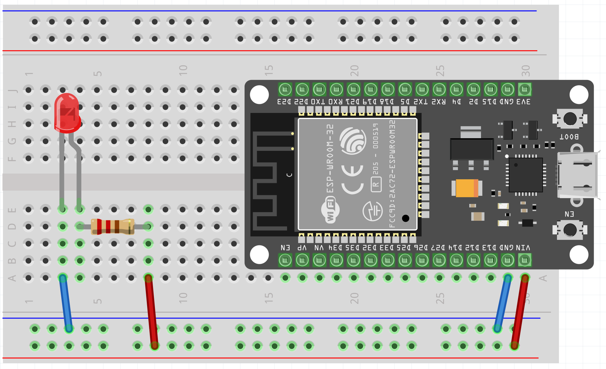

Regarding Ohm's law, ask yourself the following question: why is a resistor needed in this circuit?
What is the resistance value of this resistor?

## blinking wired led

With the code form the blinking led still on the esp, change the circuit to this:

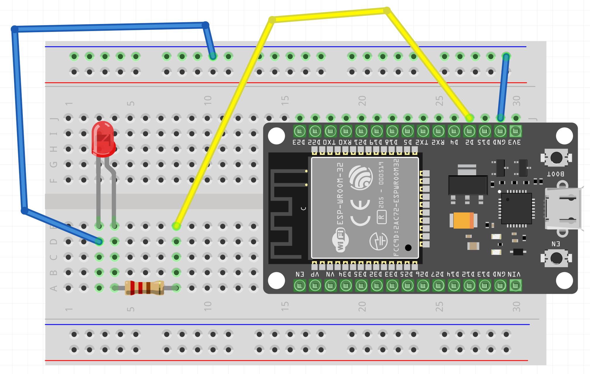

The red led should now blink in sync with the blue onboard led. 

Look at the code and try to understand what is happening, what makes the led blink?

By using ``digitalWrite`` we can set any pin to either HIGH (3.3v) or LOW (0v). As a result current will either flow, or it won't.

# Fading led

With the same schema you can also dim a led.
A led can only be on or off but with Pulsewidthmodulation (PWM) you can quickly switch the led on and off. For our eyes it seems like the led is dimmed instead of shining bright.

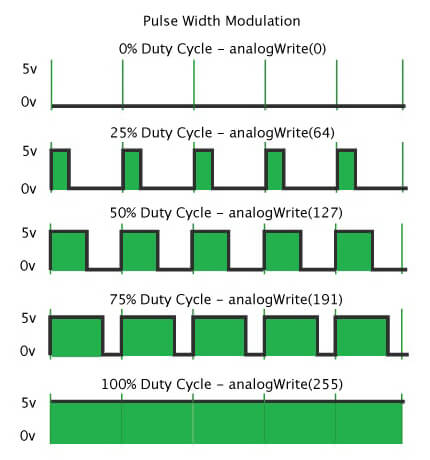

On every arduino the easiest way is to initialise ``pinMode(pin, OUTPUT);`` and use ``analogWrite(pin, pwm);`` to give a duty cycle between 0 and 255.

Example project: [pwm-led](02-pwm-led)

# multiple leds

Connect more leds and write code to address them individually.
- Use a different pin for each led
- don't forget to give each led its resistor


# buttons and serial monitor

Make this circuit:

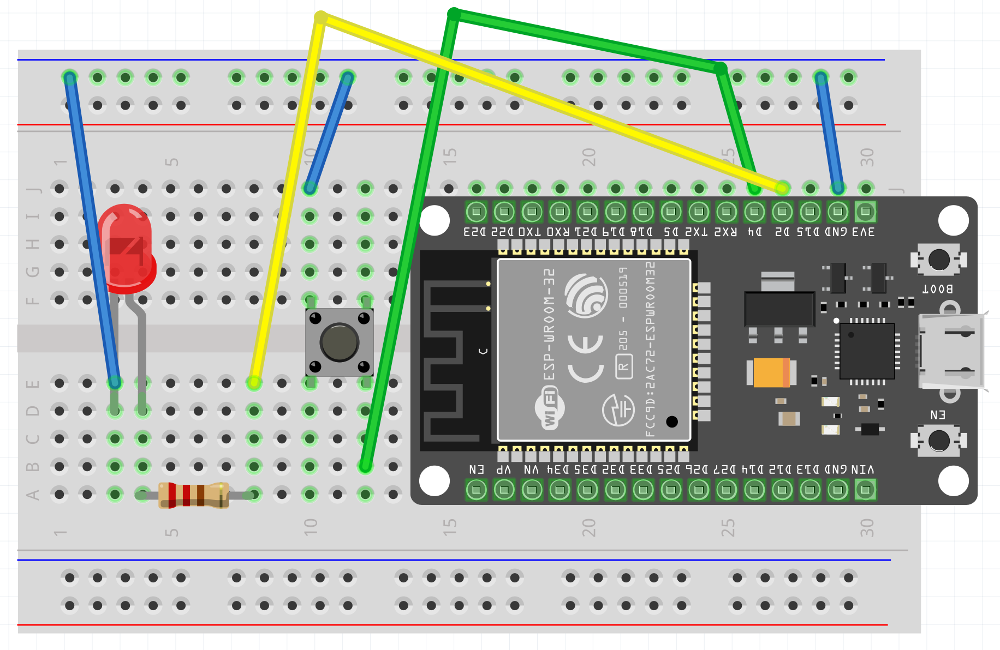

Start the serial monitor with a baud rate of 115200: ``Serial.begin(115200);``

Add this line in ``platformio.ini`` to match the baud rate

```
monitor_speed = 115200
```

Example project: [buttons-serial-monitor](03-buttons-serial-monitor)

# Reading an analog value: the light sensor

The LDR (Light Dependent Resistor) changes its resistor value according to the amount of light it captures. When conected in the right way to an arduino, it gives a different analog voltage level that can be read by the arduino and used in your code.

To connect this LDR to your arduino, you need to connect it via a *voltage divider* circuit.

Connect the **3.3v pin** (or 5v) via a **10k &#8486; resistor** to one side of the LDR. Connect the other pin of the LDR to **gnd**. This will be your base connection. Current flows through the LDR, but because of the high resistor, your LDR won't burn.

Now the interesting part: because the LDR is a variable resistor, the voltage will be divided between the fixed resistor and the LDR. The measurement in between, will give a certain voltage that can be read and interpreted by the pin of the arduino.

So connect the point between these two with a pin on your arduino.

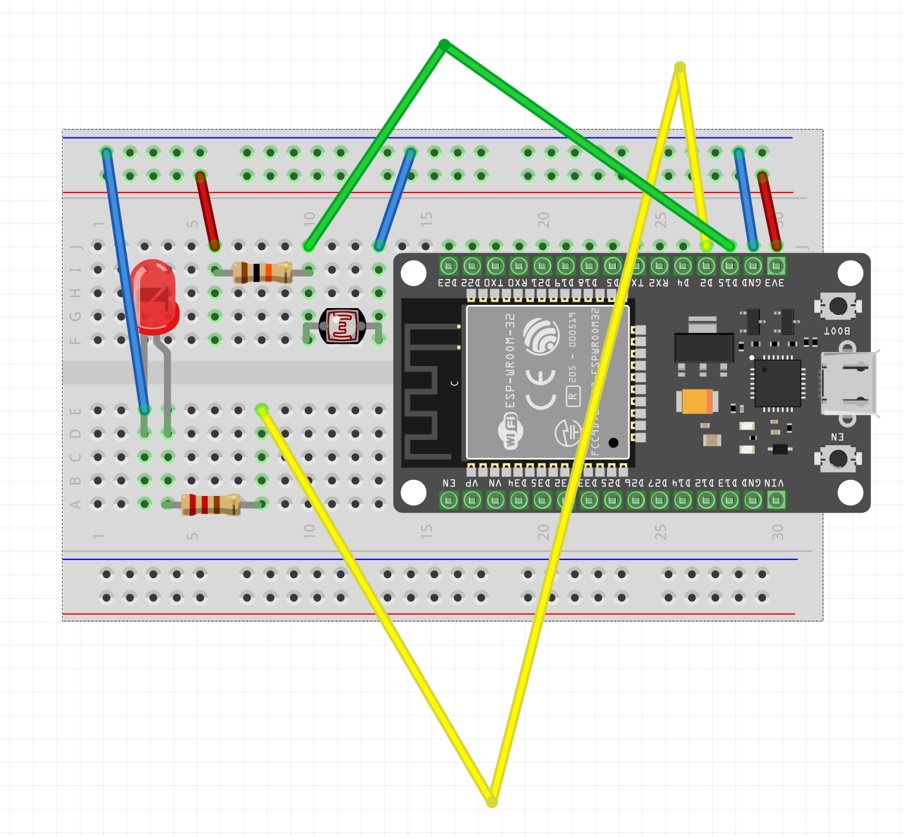

What happens next on this pin is an analog to digital conversion: ADC. If you look again at the [pinout for the esp32-wroom-32](images/ESP32-NodeMCU-32S-Pinout.png) you will see that some pins have **ADC** next to them. These pins will automatically do this conversion for you and give a value in your caode you can use.

Check the example project: [light sensor](04-light-sensor).

Check the serial monitor for the readings and adjust your threshold value to make sure the led goes on when the light sensor is covered.


# using a library: oled screen

The oled screen has a SH1106 chip and uses i2c to communicate with the esp32.

## adding library

One way to add a library is to use the ``platformio.ini`` file and let the IDE do the rest.

add these lines:
```
lib_deps = 
	adafruit/Adafruit GFX Library@^1.11.9
	https://github.com/nhatuan84/esp32-sh1106-oled
```

Upon saving ``platformio.ini``, the IDE downloads and imports all the files for the current board. 

## inspecting the library examples

most libraries have some example files.

For the sh1106 library, browse them in the hidden folder: ``.pio/libdeps/esp32dev/Adafruit SH1106/examples``

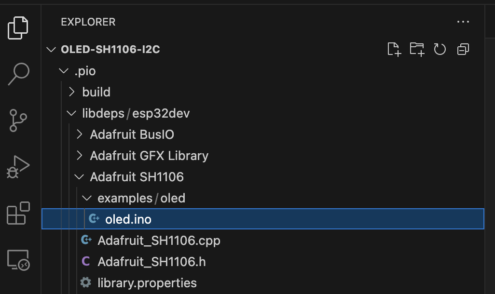

## example project

Use the oled screen to make this circuit:

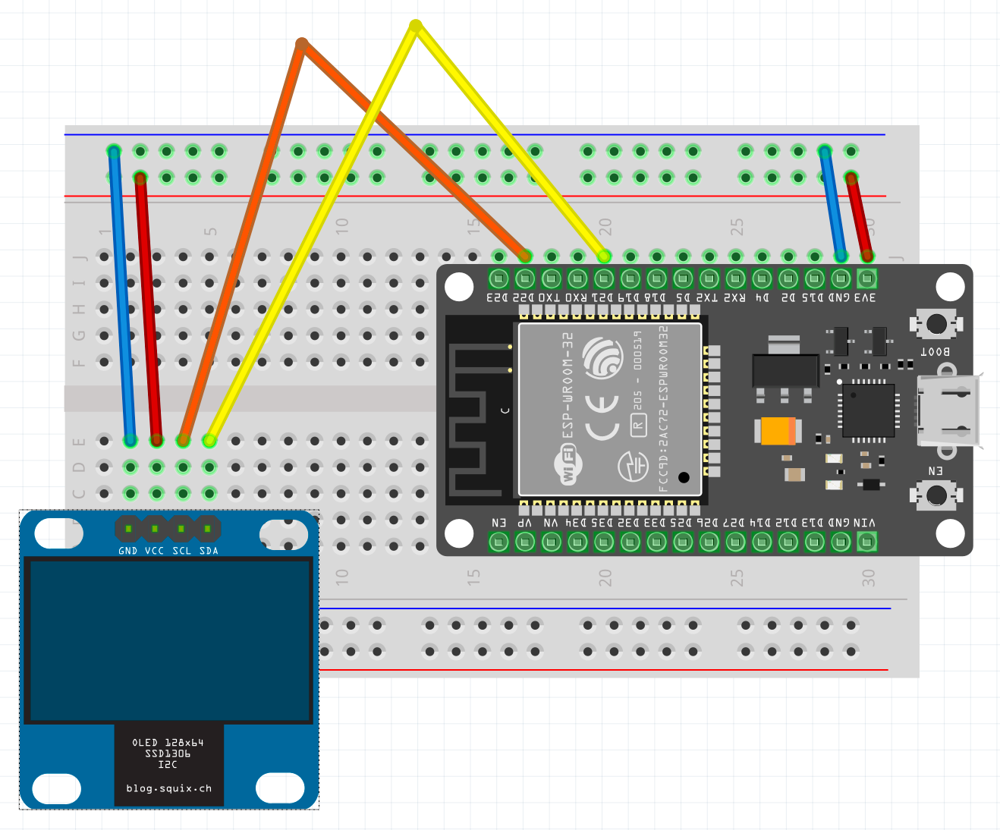

Example project: [oled-sh1106-i2c](05-oled-sh1106-i2c)


# wifi, https request and websockets (socket.io)

Adding WiFi via standard library and ``#include <WiFi.h>``

- Make a circuit with the oled and a button connected to gpio 4 on the esp32.
- Check out the example project: [wifi-websockets](05-wifi-websockets)
- create the ``config.h`` file 
  - Fill out the WiFi credentials
  - Choose a unique syncword for the communication between your esp32 and the demo backend at [https://websocket.itip-demo.ucll.cloud](https://websocket.itip-demo.ucll.cloud)
  - Add the demo websocket backend:
```
const char* host        = "websocket.itip-demo.ucll.cloud";
const uint16_t port     = 8890;
```

This syncword is used to create a room in socket.io. You will receive only events in this room, but be carefull with sensitive information because there is no encryption.

## http(s) request

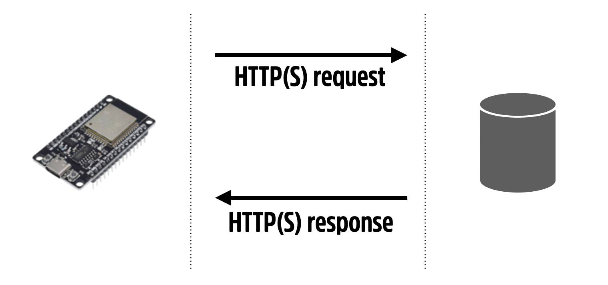

## socket.io connection

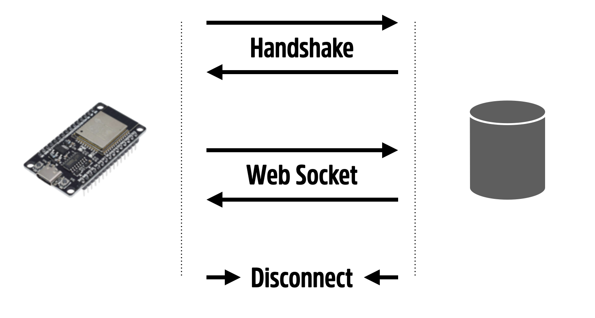

## event driven

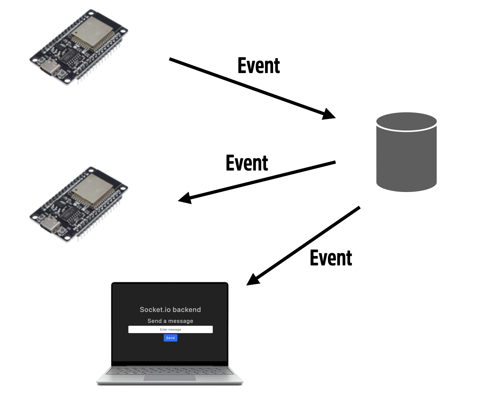

## socket.io client

demo code for the client: [socket.io client](06-wifi-websockets)


## socket.io server

Some demo code for a [socket.io enabled server in node.js](https://github.com/UCLL-Integration-Project/socket-test-backend)


# Accelerometer

An accelerometer measures movement and direction. It is the same sensor that is used in smartphones to get the orientation or movement.

Open the demo code : [accelerometer](07-accelerometer) read the inline documentation for the connections and try to get the values in your serial monitor.

# I2C

I2C is a bus protocol for electronics. You used it for the oled screen, but because it is a bus protocol, multiple devices and sensor can be connected on the bus at the same time.

Each sensor/device has it's own address.

Two wires connect everything:
- SDA — serial data line: on the esp32: **pin GPIO 21** | on the arduino nano: **A4**
- SCL — serial clock line on the esp32: **pin GPIO 22** | on the arduino nano: **A5**

Each device also needs power (3.3v) and gnd

## exercise

Combine the oled and the accelermoter to get the values of the axis on the oled screen.

Tip: If you want to debug or discover your i2c devices connected, There is [code for an i2c scanner](extra-i2c-scanner) too.

# radio communication via 433Mhz

Now the fun and tricky part: open radio communication via 433Mhz.

433 MHz is a license-free radio frequency in the ISM band (Industrial, Scientific and Medical), meaning anyone can use it without a permit. It's been around for decades and you'll find it everywhere in everyday life: Garage door openers, old car key fobs, wireless doorbells, simple home alarm sensors, ... 

You have a transmitter (TX) and a receiver (RX)

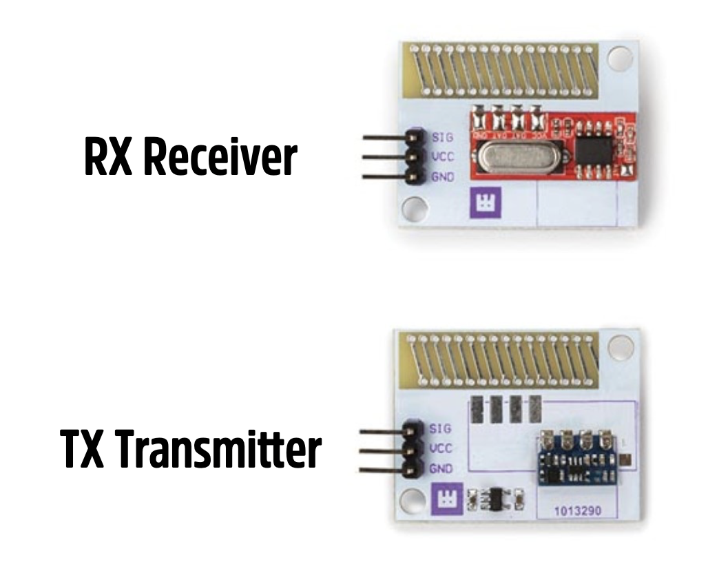

It is very easy to use, They need VCC and GND and one pin each. look at the [example code](08-433Mhz-communication).

**BUT** the communication is completely open. The TX is like a radio station: everybody in signal range can receive the data. And it is only one channel so one signal can be send at one time, you can jam and block messages.

So: You need encryption. This is a challange, but there are plenty examples online. Search for encryption and rolling code to avoid replay attacks ...

# final example: motion detection

A final example of two clients can be found here: [motion detection system](09-433Mhz-motion-detection)

